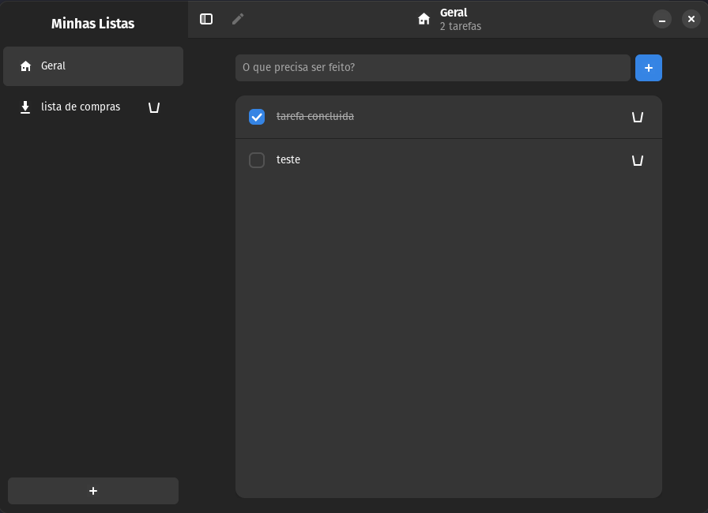

# TodoList GTK - Nativo Linux 🐧

Bem-vindo ao **TodoList GTK**, um gerenciador de tarefas moderno, leve e elegante desenvolvido especificamente para o ambiente Linux usando **GTK4** e **Libadwaita**.

Este projeto funciona como um experimento pratico de desenvolvimento assistido por IA para validar a construcao de um aplicativo desktop nativo do zero, com foco em UX consistente, empacotamento Linux e documentacao viva.



## ✨ Funcionalidades

- **Layout Estilo Simplenote:** Interface de duas colunas com barra lateral para organização.
- **Múltiplas Sessões (Listas):** Crie diferentes categorias para suas tarefas (Trabalho, Casa, Estudos, etc).
- **Ícones Inteligentes:** O app atribui ícones automaticamente baseado no nome das suas listas.
- **Header Contextual:** O topo da janela mostra a lista ativa, o ícone atual e a contagem de tarefas daquela sessão.
- **Modo Live Reload:** Ambiente de desenvolvimento ágil que reinicia o app automaticamente ao salvar o código.
- **Persistência Local:** Seus dados são salvos de forma segura em um banco de dados SQLite local.
- **Dark Mode Nativo:** Total integração com as preferências de tema do seu sistema GNOME.

## 🚀 Como Executar

### Pré-requisitos
O projeto depende de algumas bibliotecas de sistema (GTK4, Libadwaita, Python Dev).
👉 **Veja o [Guia de Configuração de Ambiente](docs/knowledge/environment-setup.md)** para preparar sua máquina.

### Rodando o Projeto
1. Clone o repositório.
2. Na raiz do projeto, execute:
```bash
# Execução normal
make run

# Modo de desenvolvimento (Live Reload)
make dev
```

## 🏗️ Como funciona o Build

O projeto mantém dois fluxos separados:
- **Binário Local:** `make build` gera um executável em `dist/` com PyInstaller para testes rápidos.
- **Instalação Flatpak:** `make flatpak` instala o app no seu menu de aplicativos usando o runtime GNOME.
- **Geração de Bundle:** `make bundle` gera o arquivo `todolist.flatpak` portável na raiz, sem usar o binário PyInstaller.

## 📦 Distribuição Oficial (Flatpak)

O ID oficial do aplicativo é **br.com.vitordevsp.TodoList**. Para gerar o instalador final:

1.  Certifique-se de ter o `flatpak-builder` instalado.
2.  Execute:
    ```bash
    make bundle
    ```
Isso criará o arquivo `todolist.flatpak` na raiz, pronto para ser enviado para outros usuários ou instalado com `flatpak install`.

## 📝 Artigos e Consolidação de Conhecimento

Uma parte do objetivo deste repositorio e transformar o historico real do
projeto em conhecimento reutilizavel. Por isso, alem de `plans`, `reports` e
`knowledge`, o projeto tambem gera artigos editoriais finais para consolidar o
que foi aprendido em formato mais narrativo e consultavel.

Os dois artigos finalizados deste ciclo sao:

- [IA nao fez o app sozinha, mas mudou tudo](./docs/articles/experiencia-desenvolvimento-ia-sem-dominar-stack.md)
- [Do zero ao Flatpak: criando um app nativo para Linux com Python e GTK](./docs/articles/linux-gtk-flatpak-com-ia.md)

---

## 🧪 Contexto do Projeto
Este software e uma demonstracao de colaboracao entre humano e IA. O repositorio registra nao so o app, mas tambem planos, conhecimento tecnico, logs e relatorios que ajudam a manter o projeto evolutivo.

---

Desenvolvido por **[vitordevsp](https://vitordevsp.com.br)** com apoio de assistentes de IA ao longo do ciclo de planejamento, implementacao e documentacao.
